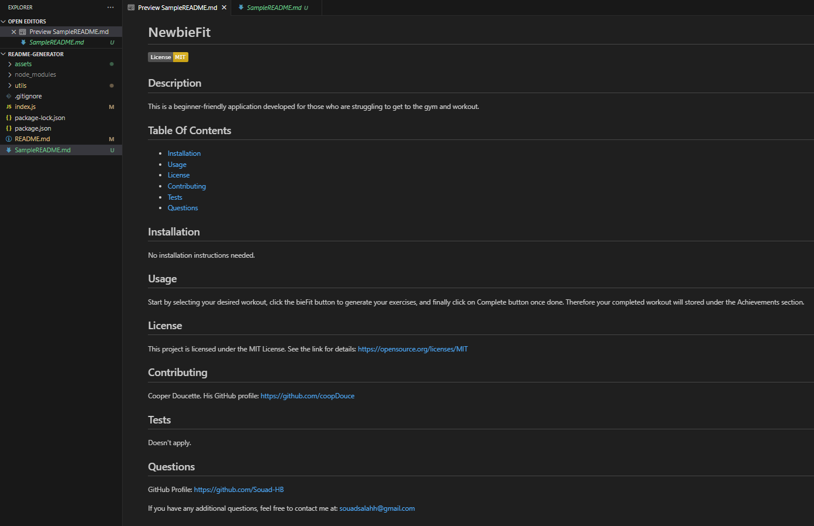

# README-Generator

## Description
This command line application dynamically generates a professional README.md file.This allows project creators to devote more time working on their project. 
Check out the `SampleREADME.md` in this repository as an example.

## Installation
- Install the application by cloning the repo down to your local.
- Install Node.js
- Install the inquirer package using "npm i inquirer" from the terminal on the application folder's path.

## Usage
- Make sure you are under the path of the application's folder and run: "node index.js"
- This is then going to prompt you for a series of questions regarding your project. Answer each one of the questions. or skip if you feel like it is irrelevant to your project. 
- Once done you will get a message that says "Your data has been logged!". 
- Your README file will be named `SampleREADME.md` and will be located in the root of the repo.
- When you click on the links in the Table of Contents, you are then taken to the corresponding section of the README.

The below screenshots elaborate on what questions are prompted, how a sample README file can be generated and where it is located.

## Demo Link

 

