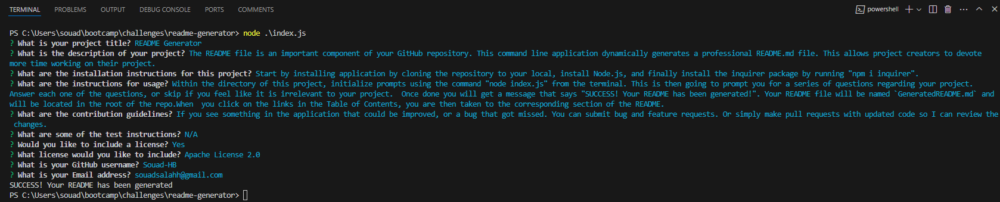

# README Generator

## Description
The README file is an important component of your GitHub repository. This command line application dynamically generates a professional README.md file. This allows project creators to devote more time working on their project. 

## Installation
- Install the application by cloning the repository to your local.
- Install Node.js
- Install the inquirer package using "npm i inquirer" from the terminal on the application folder's path.

## Usage
- Within the directory of this project, initialize prompts using the command "node index.js" from the terminal.
- This is then going to prompt you for a series of questions regarding your project. Answer each one of the questions, or skip if you feel like it is irrelevant to your project. 
- Once done you will get a message that says "SUCCESS! Your README has been generated". 
- Your README file will be named `GeneratedREADME.md` and will be located in the root of the repo.
- When you click on the links in the Table of Contents, you are then taken to the corresponding section of the README.

The below screenshot elaborates on what questions can be prompted. A project repo was used as an example.

## Demonstration
Watch this [demo](https://watch.screencastify.com/v/j9qZfdL8D8RUU3MUZubc) to see the README Generator in full action. 

## Questions
If you have any questions, contact me at: souadsalahh@gmail.com

GitHub profile: [GitHub](https://github.com/Souad-HB)

 

